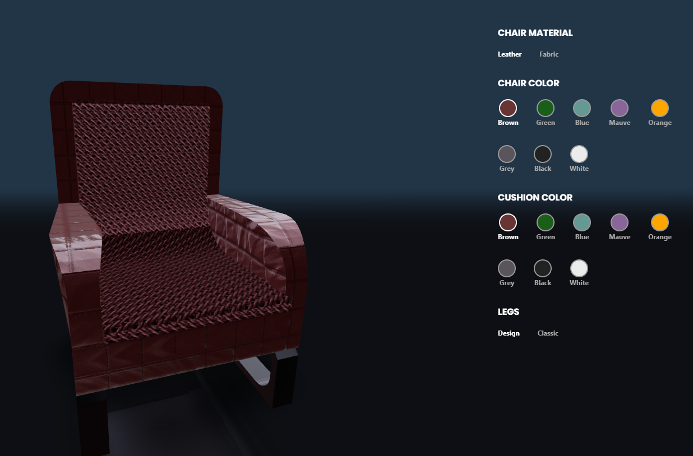

#3D builder app

Overview

Builder App is a React-based 3D chair configurator built with React Three Fiber and @react-three/drei. This application allows users to customize a chair by selecting different materials, colors, and leg designs in real time.

Features

3D Chair Customization: Change chair material, color, and leg style interactively.

Realistic Textures: Uses high-quality textures for leather and fabric materials.

Live Updates: Chair updates instantly as the user selects different customization options.

Interactive UI: A clean and intuitive UI built with Tailwind CSS.

Optimized Performance: Uses Three.js optimizations for smooth rendering.

Technologies Used

React 18 - Frontend framework

React Three Fiber - 3D rendering

@react-three/drei - Utility components for Three.js

Three.js - Underlying 3D library

Vite - Fast development and build tool

Tailwind CSS - Styling framework

Installation

To run the project locally, follow these steps:

1. Clone the repository

git clone https://github.com/Rickzzyy/builder-app.git
cd builder-app

2. Install dependencies

npm install

3. Start the development server

npm run dev

The application will be available at http://localhost:5173/.

Project Structure

├── public/ # Static assets
│ ├── models/ # 3D models (GLTF)
│ ├── textures/ # Texture images
├── src/
│ ├── components/ # React components
│ │ ├── Configurator.js # UI for chair customization
│ │ ├── Experience.js # 3D scene with the chair model
│ │ ├── Chair.js # 3D chair component
│ ├── context/ # Customization context
│ ├── App.js # Main application file
│ ├── main.js # React entry point
│ ├── styles/ # Global styles
├── package.json # Project metadata and dependencies
├── vite.config.js # Vite configuration
└── README.md # Project documentation

Customization Options

Chair Material: Leather or Fabric

Chair Color: Brown, Green, Blue, Mauve, Orange, Grey, Black, White

Cushion Color: Brown, Green, Blue, Mauve, Orange, Grey, Black, White

Legs Style: Design or Classic

Screenshots

